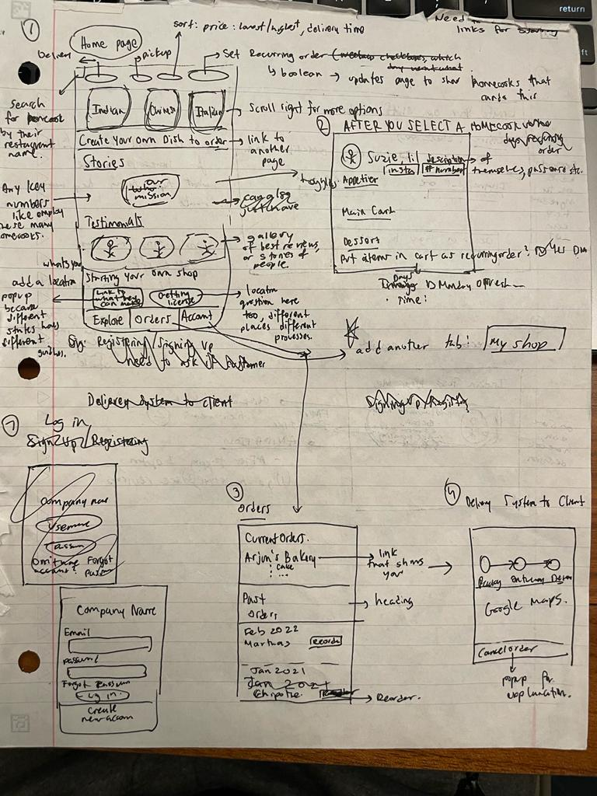
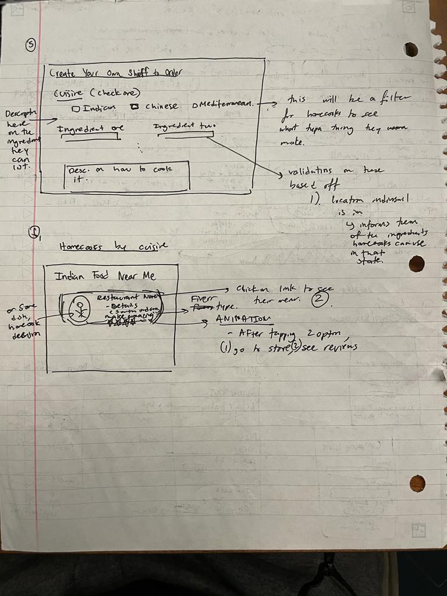

The content below is an example project proposal / requirements document. Replace the text below the lines marked "__TODO__" with details specific to your project. Remove the "TODO" lines.

(__TODO__: your project name)

# Made @ Home 

## Overview

(__TODO__: a brief one or two paragraph, high-level description of your project)


Bored of the same rotation of 5 fast-food places? College student? Aching for meals that taste like home? That’s where Made @ Home comes in. 

Made @ Home is a web app that will allow users to pick the cuisine they would like to order food in, but the twist is that rather than it being prepared at a restaurant, ghost kitchen or some other commoditized location, it will be prepared by home-cooks! Find the delicacies you can only get at your home away from home. Select from a wide array of homecooks that specialize in that flavor you love but can’t find in restaurant. 

The web app will incorporate review system for the homecooks, optionality for customers to describe exactly the recipes they would like made by homecooks and give homecooks a platform to grow others’ appreciation of their skills in a cost-effective manner! 


## Data Model

(__TODO__: a description of your application's data and their relationships to each other) 

The application will store Users, Orders, Menus and Shops

(__TODO__: sample documents)

As can be seen some of the following models are connected by the username, homecook_id etc. 

An Example User: Added a record for specifying the user will have a normal customer's fuctionalities and/or a homecook's functionalities (for example, which can include seeimgg orders placed by people). 

```javascript
{
  username: "shannonshopper",
  password: // a password hash,
	userRoles: ['Normal', 'homecook']
}
```

An Example User's order (their cart): 

```javascript
{
	username: "shannonshopper" // connecting a user and their order 

  homeCook_id: [UUIDs] // can be like a UUID not sure, some identification to map the homecook they are ordering from. Array because maybe they order from multiple locations 

	foodItems: [ids] // each food item on a homecook's menu can be connected to an id that we store in this array. this will likely be a 2D array to account for ordering from mutliple homecooks and as such multiple menus. 
}
```
An Example Menu: Storing the things that a Homecook has on their menu in a database. 
```javascript
{
  homeCook_id: "shannonshopper",

	// in case a homecook is able to cater for a wide variety of cusines
  menu: {'italian': [('pizza', $10), ('pasta', $10)], {'indian': [('paneer butter masala', $10), ('naan', $10)]}  

// if the homeCook takes reciepes/directins from the user then this record will be used to store that. 
	userCreation: {"name": Paella, "ingredients": '1 Cup Water\n 1 Cup Tomato', "Description": "heat pan for 10 minutes, add the tomatoes..."}
}

```

## [Link to Commented First Draft Schema](db.mjs) 

(__TODO__: create a first draft of your Schemas in db.mjs and link to it)

## Wireframes

(__TODO__: wireframes for all of the pages on your site; they can be as simple as photos of drawings or you can use a tool like Balsamiq, Omnigraffle, etc.)

Web Pages 1 



Web Pages 2 
 


## Site map

(__TODO__: draw out a site map that shows how pages are related to each other)

The Home Page will have links to that lead to pages like Getting License, which will detail to a user on how to get the proper certification to sell food from home and provide them with any relevant links. Other pages linked to from the homepage include My Shop, which will be specifically for the home cook to accesss so that they can see the orders people have placed, mark them as prepared, check their delivery status, check the history of their orders, edit their menu etc. there will also be another link on the Home Page that is Explore. This will allow you to see a page which has information on different homecooks, the reviews people have put of them, what they specialize in making, along with filtering functions based on cuisine, prices, location, reviews etc. On My Shop there will also be the Explore page again in case they want to order something themselves. 

## User Stories or Use Cases

(__TODO__: write out how your application will be used through [user stories](http://en.wikipedia.org/wiki/User_story#Format) and / or [use cases](https://en.wikipedia.org/wiki/Use_case))

1. as non-registered user, I can register a new account with the site and even specify if I want to be a home cook on the platform too (you will be able to create a home cook credential later as well).  
2. as a non-registered user, I can still explore and order food from the website. 
3. as a home cook, I can have My Store, which will allow me to make a menu, take orders from people, track them, and do bookkeeping. 
4. As a registered user, I can create a home cook credential.
5. As a registered user, I can see a list of all my past orders 


## Research Topics

(__TODO__: the research topics that you're planning on working on along with their point values... and the total points of research topics listed)

I am planning on using React.js (6 points) as my frontend framework which is a JavaScript library for building interactive and dynamic user interfaces (UIs). I am planning on using this because I have some experience working with it, and I like the component-based architecture that it has. This allows me to have a self-contained reusable piece of code on how different parts of the user interface should appear and behave. I am also planning on using client side form validation (3 points) using custom JavaScript or JavaScript *library*. Specifically, I might use Formik which is designed to work well with React forms like in the display of errors or custom validation logic. Finally, I am thinking of using Bootstrap (2 points) to have a defined theme for my website across my webpages. This will allow my webpage to be more unique and friendly to users. 


## [Link to Initial Main Project File](app.mjs) 

(__TODO__: create a skeleton Express application with a package.json, app.mjs, views folder, etc. ... and link to your initial app.mjs)

## Annotations / References Used

(__TODO__: list any tutorials/references/etc. that you've based your code off of)

1. [passport.js authentication docs](http://passportjs.org/docs) - (add link to source code that was based on this)
2. [tutorial on vue.js](https://vuejs.org/v2/guide/) - (add link to source code that was based on this)

